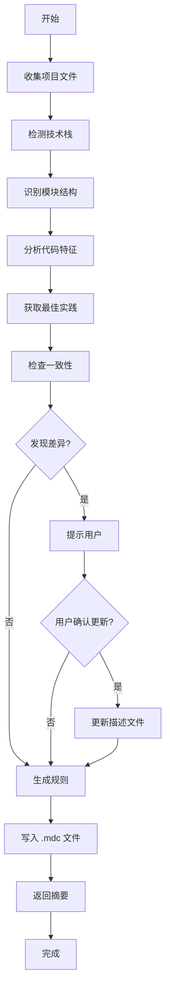

# Cursor Rules Generator

[English](./README.md) | 简体中文

一个智能 MCP Server，能够自动分析项目并生成符合项目特点的 Cursor Rules。

## 🌟 核心功能

### 自动化分析
- **智能文件扫描**：递归扫描项目目录（最多10层），自动排除无关文件
- **技术栈识别**：准确识别 20+ 种主流技术栈和框架
- **依赖分析**：解析 package.json、requirements.txt 等配置文件
- **模块检测**：支持 monorepo、微服务、前后端分离等架构

### 代码特征分析
- **组件结构识别**：自动发现自定义组件和复用模式
- **API 路由分析**：识别 RESTful API 和路由结构
- **状态管理检测**：识别 Redux、Vuex、Pinia 等状态管理方案
- **样式方案识别**：检测 CSS Modules、Tailwind、styled-components 等
- **测试覆盖分析**：统计测试文件和测试框架使用情况
- **数据库集成检测**：识别 Prisma、TypeORM、Mongoose 等 ORM

### 智能规则生成
- **全局规则**：基于整体技术栈生成通用开发规范
- **模块规则**：为不同模块生成专属规则（前端、后端、共享等）
- **最佳实践集成**：整合框架官方推荐和社区最佳实践
- **自定义平衡**：在项目实际实现与标准实践间找到平衡

### 一致性保障
- **文档对比**：检查 README 与实际代码的一致性
- **差异提示**：友好地提示发现的不一致
- **自动更新**：可选的自动更新描述文档功能
- **人工确认**：重要变更需要用户确认

## 🚀 快速开始

### 安装步骤

#### 方式一：通过 npm 安装（推荐）

```bash
# 全局安装
npm install -g cursor-rules-generators

# 或本地安装到项目
npm install cursor-rules-generators
```

**配置到 Cursor：**

找到 Cursor 的 MCP 配置文件：

- **macOS/Linux**: `~/Library/Application Support/Cursor/User/globalStorage/saoudrizwan.claude-dev/settings/cline_mcp_settings.json`
- **Windows**: `%APPDATA%\Cursor\User\globalStorage\saoudrizwan.claude-dev\settings\cline_mcp_settings.json`

**如果全局安装**，添加以下配置：

```json
{
  "mcpServers": {
    "cursor-rules-generator": {
      "command": "cursor-rules-generator",
      "disabled": false,
      "alwaysAllow": []
    }
  }
}
```

**如果本地安装**，需要找到 `node_modules` 中的可执行文件路径：

```json
{
  "mcpServers": {
    "cursor-rules-generator": {
      "command": "node",
      "args": ["/项目路径/node_modules/cursor-rules-generators/dist/index.js"],
      "disabled": false,
      "alwaysAllow": []
    }
  }
}
```

或者使用 `npx`：

```json
{
  "mcpServers": {
    "cursor-rules-generator": {
      "command": "npx",
      "args": ["-y", "cursor-rules-generators"],
      "disabled": false,
      "alwaysAllow": []
    }
  }
}
```

#### 方式二：从源码安装

```bash
# 克隆仓库
git clone https://github.com/ALvinCode/fe-cursor-rules-generator.git
cd cursor-rules-generator

# 安装依赖
npm install

# 构建项目
npm run build
```

**配置到 Cursor：**

```json
{
  "mcpServers": {
    "cursor-rules-generator": {
      "command": "node",
      "args": ["/绝对路径/cursor-rules-generator/dist/index.js"],
      "disabled": false,
      "alwaysAllow": []
    }
  }
}
```

**重要**：将 `/绝对路径/cursor-rules-generator` 替换为实际路径。

#### 3. 重启 Cursor

完全退出 Cursor 并重新打开，使配置生效。

### 基本使用

在 Cursor 的 AI 聊天窗口中：

```
请为当前项目生成 Cursor Rules
```

或指定项目路径：

```
请为 /Users/zhangsan/projects/my-web-app 生成 Cursor Rules
```

## 📖 详细使用指南

### 工具列表

#### 1. generate_cursor_rules - 生成规则

**功能**：完整分析项目并生成 Cursor Rules

**参数**：
```typescript
{
  projectPath: string;        // 必需：项目根目录绝对路径
  updateDescription?: boolean; // 可选：是否自动更新描述文件（默认 false）
  includeModuleRules?: boolean; // 可选：是否生成模块规则（默认 true）
}
```

**使用示例**：
```
请使用以下参数生成规则：
- 项目路径：/Users/zhangsan/my-project
- 自动更新描述：是
- 包含模块规则：是
```

#### 2. analyze_project - 分析项目

**功能**：仅分析项目，不生成规则文件，返回详细的项目信息

**参数**：
```typescript
{
  projectPath: string;  // 必需：项目根目录绝对路径
}
```

**返回信息**：
- 文件统计（总数、类型分布）
- 技术栈详情（语言、框架、依赖）
- 模块结构（类型、路径、职责）
- 代码特征（组件、API、状态管理等）

**使用示例**：
```
请分析 /Users/zhangsan/my-project 的项目结构
```

#### 3. check_consistency - 一致性检查

**功能**：检查项目描述文档与实际代码的一致性

**参数**：
```typescript
{
  projectPath: string;  // 必需：项目根目录绝对路径
}
```

**检查内容**：
- README 中的技术栈描述是否准确
- 重要功能是否有文档说明
- 是否存在过时的技术栈描述
- package.json 中的描述是否完整

**使用示例**：
```
请检查项目文档与代码的一致性
```

#### 4. update_project_description - 更新描述

**功能**：根据实际代码自动更新项目描述文档

**参数**：
```typescript
{
  projectPath: string;       // 必需：项目根目录绝对路径
  descriptionFile?: string;  // 可选：要更新的文件（默认 README.md）
}
```

**使用示例**：
```
请根据实际代码更新 README
```

## 🔄 完整工作流程



### 详细步骤说明

1. **文件收集**
   - 递归扫描项目目录（最多10层）
   - 排除 node_modules、.git 等无关目录
   - 识别代码、配置、文档文件

2. **技术栈检测**
   - 解析 package.json、requirements.txt 等
   - 识别主要框架和库
   - 确定包管理器和构建工具

3. **模块识别**
   - 检测 monorepo 结构（lerna、pnpm workspace）
   - 识别前后端分离架构
   - 发现微服务组织方式

4. **代码分析**
   - 统计组件数量和类型
   - 识别 API 路由定义
   - 分析状态管理方案
   - 检测样式处理方式
   - 评估测试覆盖情况

5. **最佳实践**
   - 集成内置的框架最佳实践
   - （可选）从 Context7 获取最新文档

6. **一致性检查**
   - 比对 README 与实际技术栈
   - 验证功能描述的准确性
   - 发现过时或错误的信息

7. **规则生成**
   - 生成全局开发规范
   - 为每个模块生成专属规则
   - 整合最佳实践建议

8. **文件输出**
   - 在 .cursor/rules/ 创建目录
   - 写入 .mdc 格式的规则文件
   - 按优先级组织规则

## 📁 输出文件结构

### 单体项目

```
你的单体项目/
├── .cursor/
│   └── rules/
│       └── 00-global-rules.mdc      # 全局规则
├── src/
├── package.json
└── README.md
```

### 多模块项目（智能层级生成）

```
你的多模块项目/
├── .cursor/
│   └── rules/
│       └── 00-global-rules.mdc      # 全局通用规则
├── frontend/
│   ├── .cursor/
│   │   └── rules/
│   │       └── frontend-rules.mdc   # 前端模块规则
│   └── src/
├── backend/
│   ├── .cursor/
│   │   └── rules/
│   │       └── backend-rules.mdc    # 后端模块规则
│   └── src/
└── shared/
    ├── .cursor/
    │   └── rules/
    │       └── shared-rules.mdc     # 共享模块规则
    └── src/
```

**智能特性**：
- ✅ 全局规则放在项目根目录，影响整个项目
- ✅ 模块规则放在各自模块目录，只影响该模块
- ✅ Cursor 根据当前文件位置自动加载相应规则
- ✅ 模块规则可以覆盖全局规则的配置

### 规则文件内容示例

```markdown
---
title: my-web-app - 全局开发规则
description: 基于项目实际情况和最佳实践自动生成的 Cursor Rules
priority: 100
---

# 项目概述

这是一个基于 React, TypeScript, Next.js 的项目。

## 技术栈

**主要技术栈：**
- React
- TypeScript  
- Next.js

**语言：** TypeScript, JavaScript

**包管理器：** pnpm

**框架：** Next.js

## 项目结构

这是一个多模块项目，包含以下模块：

**前端模块：**
- web

**后端模块：**
- api

**共享模块：**
- shared

## 核心功能特征

### 项目使用自定义组件结构

- **类型：** custom-components
- **使用频率：** 42 处
- **示例：** Button.tsx, Card.tsx, Modal.tsx

### 项目包含 API 路由定义

- **类型：** api-routes
- **使用频率：** 15 处
- **示例：** users/route.ts, posts/route.ts

### 使用 zustand 进行状态管理

- **类型：** state-management
- **使用频率：** 8 处
- **示例：** useUserStore.ts, useCartStore.ts

---

# 开发规范

## TypeScript 使用

- 优先使用 TypeScript 编写新代码
- 为所有公共 API 提供完整的类型定义
- 启用严格模式 (`strict: true`)
- 避免使用 `any`，使用 `unknown` 或具体类型

## React 开发

- 使用函数组件和 Hooks，避免类组件
- 遵循组件单一职责原则
- 使用 PropTypes 或 TypeScript 进行类型检查
- 合理使用 `useMemo` 和 `useCallback` 优化性能

## Next.js 规范

- 优先使用 App Router（如果项目使用）
- Server Components 中进行数据获取
- 使用 `next/image` 优化图片
- 配置适当的元数据以改善 SEO

...
```

## 🎯 支持的技术栈

### 前端框架
| 框架 | 检测方式 | 生成规则 |
|------|---------|---------|
| React | package.json | ✅ 组件、Hooks、性能优化 |
| Vue | package.json | ✅ Composition API、组件通信 |
| Angular | package.json | ✅ 模块、依赖注入、RxJS |
| Svelte | package.json | ✅ 响应式、组件设计 |
| Next.js | package.json | ✅ 路由、SSR、优化 |
| Nuxt | package.json | ✅ 目录结构、SSR |

### 后端框架
| 框架 | 检测方式 | 生成规则 |
|------|---------|---------|
| Express | package.json | ✅ 中间件、路由、错误处理 |
| Fastify | package.json | ✅ 插件、性能优化 |
| NestJS | package.json | ✅ 模块、依赖注入、装饰器 |
| Django | requirements.txt | ✅ MTV、ORM、最佳实践 |
| Flask | requirements.txt | ✅ 蓝图、扩展、RESTful |
| FastAPI | requirements.txt | ✅ 类型注解、异步、文档 |

### 编程语言
| 语言 | 检测方式 | 生成规则 |
|------|---------|---------|
| TypeScript | .ts/.tsx 文件 | ✅ 类型系统、配置 |
| JavaScript | .js/.jsx 文件 | ✅ ES6+、模块化 |
| Python | .py 文件 | ✅ PEP 8、类型注解 |
| Go | go.mod | ✅ 包管理、错误处理 |
| Rust | Cargo.toml | ✅ 所有权、错误处理 |
| Java | pom.xml/build.gradle | ✅ OOP、设计模式 |

### 状态管理
- Redux / Redux Toolkit
- MobX
- Zustand
- Pinia
- Vuex
- Recoil
- Jotai

### UI 库
- Material-UI (@mui)
- Ant Design
- Chakra UI
- Tailwind CSS
- styled-components
- Emotion

### 测试框架
- Jest
- Vitest
- Mocha
- Chai
- Cypress
- Playwright
- Testing Library

## 🔧 高级配置

### Context7 集成

如果您配置了 Context7 MCP Server，本工具会自动获取最新的官方文档和最佳实践。

**配置方法**：

1. 安装并配置 [Context7 MCP Server](https://context7.ai/)
2. 在 Cursor 的 MCP 配置中添加 Context7
3. 重启 Cursor

**注意**：Context7 是可选的，未配置不影响基本功能。

### 自定义排除目录

目前排除目录是硬编码的，未来版本将支持自定义配置。

默认排除的目录：
```javascript
[
  "node_modules", ".git", "dist", "build", ".next",
  ".nuxt", "out", "coverage", ".cache", ".vscode",
  ".idea", "__pycache__", ".pytest_cache", "venv",
  "env", "target", "bin", "obj"
]
```

### 手动编辑规则

生成的规则可以手动编辑。建议：

1. **不要直接编辑生成的文件**：再次生成会覆盖
2. **创建自定义规则文件**：
   ```
   .cursor/rules/
     ├── 00-global-rules.mdc        # 自动生成
     ├── 99-custom-rules.mdc        # 手动创建（不会被覆盖）
   ```
3. **使用更高的优先级**：文件名前缀越大，优先级越高

## 📊 项目统计

生成规则时会输出详细统计：

```
✅ Cursor Rules 生成成功！

📁 生成的文件：
  - .cursor/rules/00-global-rules.mdc
  - .cursor/rules/frontend-rules.mdc
  - .cursor/rules/backend-rules.mdc

📊 项目分析结果：
  - 主要技术栈: React, TypeScript, Next.js
  - 检测到的模块: 3 个
  - 代码特征: 6 项

⚠️  一致性检查：
  - 发现 2 处不一致
  - ℹ️  描述文件未更新（请手动确认）

📝 规则摘要：
生成了 3 个规则文件：

**全局规则：**
  - 00-global-rules.mdc

**模块规则：**
  - frontend-rules.mdc (frontend)
  - backend-rules.mdc (backend)

💡 提示：规则已保存到 .cursor/rules/ 目录，Cursor 会自动加载这些规则。
```

## ❓ 常见问题

### 1. 为什么检测不到某个框架？

**可能原因**：
- 框架依赖未在 package.json 中声明
- 使用了非标准的项目结构
- 框架名称不在支持列表中

**解决方法**：
- 确保依赖正确安装
- 手动编辑生成的规则文件
- 提交 Issue 请求支持新框架

### 2. 生成的规则不符合项目实际情况？

**可能原因**：
- 项目使用了非常规的架构
- 某些代码特征未被识别

**解决方法**：
- 使用 `analyze_project` 查看分析结果
- 手动创建自定义规则文件补充
- 提供反馈帮助改进检测算法

### 3. 如何处理一致性检查的提示？

**建议流程**：
1. 先运行 `check_consistency` 查看具体问题
2. 评估是否真的需要更新文档
3. 如果需要更新，运行 `update_project_description`
4. 或者手动编辑文档使其准确

### 4. 可以为子目录生成规则吗？

**当前版本**：只能为项目根目录生成
**未来计划**：支持为任意目录生成局部规则

### 5. 规则文件可以提交到版本控制吗？

**建议**：
- ✅ 提交自定义规则文件
- ❌ 不要提交自动生成的文件
- 在 .gitignore 中添加：
  ```
  .cursor/rules/*-rules.mdc
  !.cursor/rules/99-custom-rules.mdc
  ```

## 🛣️ 路线图

### v1.1（计划中）
- [ ] 支持自定义排除目录配置
- [ ] 增加更多语言支持（PHP、Ruby、C#）
- [ ] 改进 Context7 集成
- [ ] 支持增量更新（只更新变化的规则）

### v1.2（规划中）
- [ ] Web UI 界面
- [ ] 规则模板市场
- [ ] 团队规则共享
- [ ] 规则版本管理

### v2.0（远期）
- [ ] AI 驱动的规则优化建议
- [ ] 实时代码质量监控
- [ ] IDE 插件支持
- [ ] 企业版功能

## 🤝 贡献指南

我们欢迎所有形式的贡献！

### 报告问题
- 使用 [Issue 模板](链接到 issue 模板)
- 提供详细的复现步骤
- 附上项目的 package.json（脱敏后）

### 提交代码
1. Fork 项目
2. 创建特性分支 (`git checkout -b feature/amazing-feature`)
3. 提交更改 (`git commit -m 'Add amazing feature'`)
4. 推送到分支 (`git push origin feature/amazing-feature`)
5. 开启 Pull Request

### 开发环境设置
```bash
# 克隆你的 fork
git clone https://github.com/your-username/cursor-rules-generator.git

# 安装依赖
npm install

# 开发模式（自动重新编译）
npm run watch

# 运行测试（如果有）
npm test
```

## 📄 许可证

MIT License - 详见 [LICENSE](LICENSE) 文件

## 🙏 致谢

- Cursor 团队提供的 MCP 框架
- Context7 提供的文档集成方案
- 所有贡献者和使用者

## 📮 联系方式

- **Issues**: [GitHub Issues](链接)
- **讨论**: [GitHub Discussions](链接)
- **邮件**: your-email@example.com

---

如果这个工具对您有帮助，请给我们一个 ⭐️！

